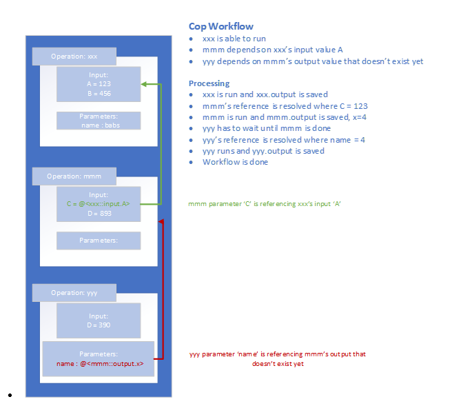

# COP (Conditional Operation Processor)

This repository contains two main packages:

## BnEGames.Cop.Api

Core API library for the Conditional Operation Processor.

## BnEGames.Cop.Processor

Processing engine for executing operations on configuration data.

## Installation

You can install these packages from GitHub Packages:

```bash
dotnet add package BnEGames.Cop.Api
dotnet add package BnEGames.Cop.Processor
```

 
## 1.	Introduction
Conditional Operation Processing aka COP is software that processes a workflow from a Json configuration. Many software solutions require a bunch of rules that ultimately determine a call-to-action or workflow. The ability to add new rules, data providers and workflows in a no code solution is attractive for reducing cost to delivery and flexibility for experimenting. However, flexibility comes with a cost of usability. COP is meant to be more flexible in nature but allows for more rigid operations to make it more usable and easier to onboard new solutions. 


## 2.	Definitions 
Name	Definition
Operation	A piece of code that is run with a set of inputs and produces an output. A class that is registered with COP and is run when that operation is ready.
Condition	An operation, but a set of pre-defined classes to support conditional logic on some parameters. Example: Comparing two output parameters to see if they are equal. 
Processing	The engine that runs through each operation and resolves any references when they are ready.
Reference aka Ref	A variable referencing some value within the Json document. The value could be within another operation, the (not yet) available operation output, or even a value within itself.

## 3.	Design Overview
COP is just running an array of operations (classes/methods) until all references are resolved and the stack is empty. An operation in this implementation is 1:1 with a class. The class is registered and has a factory to know how to instantiate. So, not all inputs need to be defined in the workflow. Only inputs that are generated by other operations. 
•	 
## 4.	Design 
### 4.1.	COP Plan
COP is a Json document with a list of operations.
| Field	| Description |	Type |	Required |
|-------|-------------|------|-----------|
|id	|GUID or unique identifier for this workflow	|string	|Yes|
|title|	User friendly name for workflow|	string|	Optional|
|operations[]|	Array of operations	|Operation[]|	Yes|
|. operation	|Operation to run|	Operation	|Yes|
|.. id	|Identifier unique to this document. |	string	|Yes|
|.. title|	User friendly name of operation.	|string|	No|
|.. type|	Type of operation. This is the key for looking up the implementing class. Typically, the full namespace + class name	|string|	Yes|
|.. mode|	Tell the operation how to run. (proxy, error… )	|string|	No|
|.. input	|Input to be passed to the implementing class. Input API. |	object|	No|
|.. parameters|	Map of key-value pairs to be referenced by the implementing class	|Dictionary<string, object>	|No|
|.. result |	Output of the operation. This is not assignable and will be produced after the run.|	object	|No|


## License

This project is licensed under the MIT License - see the LICENSE file for details.
